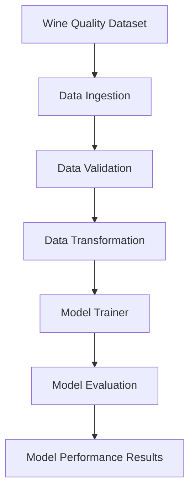
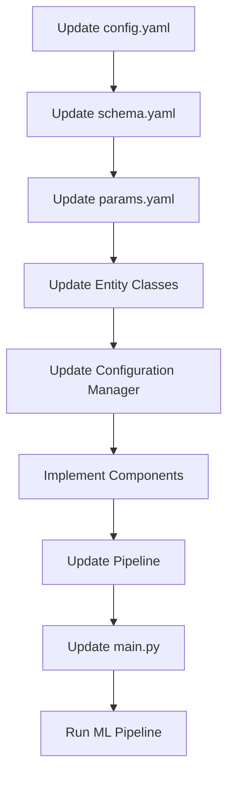

# 🍷 End-to-End Data Science Project — Wine Quality Prediction

An end-to-end machine learning project that predicts wine quality using the **Wine Quality dataset**. This project implements a modular coding approach to organize the machine learning workflow into reusable, maintainable, and scalable components.

The project follows a structured ML pipeline, covering data ingestion, validation, transformation, model training, and model evaluation.

## 🚀 Project Overview

The objective of this project is to build a complete machine learning pipeline for predicting wine quality based on its physicochemical properties.

The project focuses on applying **modular programming, configuration management, pipeline orchestration, and machine learning best practices**.

## 🔄 ML Pipeline Workflow

The project consists of the following stages:



### 1. Data Ingestion

* Download the Wine Quality dataset.
* Extract and store the dataset locally.
* Prepare the raw data for further processing.

### 2. Data Validation

* Verify the dataset structure and schema.
* Check whether the required columns are present.
* Validate the data against the defined schema.

### 3. Data Transformation

* Prepare the dataset for machine learning.
* Perform the required preprocessing steps.
* Split the data into training and testing sets, where applicable.

### 4. Model Trainer

* Train a machine learning model using the processed data.
* Save the trained model for future predictions.

### 5. Model Evaluation

* Evaluate model performance on the test dataset.
* Calculate relevant evaluation metrics.
* Store the evaluation results for analysis.

## 🏗️ Modular Coding Workflow

The project follows a structured development workflow to ensure that each stage of the machine learning pipeline is organized and maintainable.



### Development Steps

1. **Update `config.yaml`** — Define project paths and configuration settings.
2. **Update `schema.yaml`** — Define the dataset schema and required columns.
3. **Update `params.yaml`** — Configure model parameters and training settings.
4. **Update Entity Classes** — Create configuration data classes for each pipeline stage.
5. **Update the Configuration Manager** — Manage and provide configuration objects to the pipeline components.
6. **Implement Components** — Develop modular classes for data ingestion, validation, transformation, model training, and evaluation.
7. **Update the Pipeline** — Integrate the components into a sequential machine learning workflow.
8. **Update `main.py`** — Execute the complete pipeline from a single entry point.

## 📂 Project Structure

```text
datascienceproject/
│
├── .github/
│   └── workflows/
│
├── config/
│   └── config.yaml
│
├── params.yaml
├── schema.yaml
├── requirements.txt
├── setup.py
├── main.py
├── README.md
│
├── research/
│   └── experiments.ipynb
│
├── artifacts/
│   ├── data_ingestion/
│   ├── data_validation/
│   ├── data_transformation/
│   ├── model_trainer/
│   └── model_evaluation/
│
└── src/
    └── datascienceproject/
        ├── __init__.py
        ├── components/
        │   ├── data_ingestion.py
        │   ├── data_validation.py
        │   ├── data_transformation.py
        │   ├── model_trainer.py
        │   └── model_evaluation.py
        │
        ├── config/
        │   └── configuration.py
        │
        ├── constants/
        │   └── __init__.py
        │
        ├── entity/
        │   └── config_entity.py
        │
        ├── pipeline/
        │   ├── stage_01_data_ingestion.py
        │   ├── stage_02_data_validation.py
        │   ├── stage_03_data_transformation.py
        │   ├── stage_04_model_trainer.py
        │   └── stage_05_model_evaluation.py
        │
        └── utils/
            └── common.py
```

## 🛠️ Technologies Used

* **Programming Language:** Python
* **Data Processing:** Pandas, NumPy
* **Machine Learning:** Scikit-learn
* **Configuration Management:** YAML
* **Project Structure:** Modular Python architecture
* **Environment Management:** Virtual environment
* **Version Control:** Git and GitHub

## ⚙️ How to Run the Project

### 1. Clone the Repository

```bash
git clone <YOUR_GITHUB_REPOSITORY_URL>
cd datascienceproject
```

### 2. Create and Activate a Virtual Environment

```bash
python -m venv venv
```

Windows:

```bash
venv\Scripts\activate
```

### 3. Install Dependencies

```bash
pip install -r requirements.txt
```

### 4. Run the ML Pipeline

```bash
python main.py
```

The pipeline executes the configured stages and generates the required artifacts and evaluation results.

## 🎯 Key Learning Outcomes

* Understanding the complete machine learning project lifecycle.
* Implementing modular and reusable Python code.
* Managing configuration through YAML files.
* Building pipeline stages using object-oriented programming.
* Separating data processing, model training, and evaluation logic.
* Organizing an ML project for maintainability and scalability.
* Applying software engineering practices to data science workflows.

## 🔮 Future Improvements

* Add experiment tracking using MLflow.
* Integrate DVC for data and model versioning.
* Create a prediction API using FastAPI or Flask.
* Containerize the application using Docker.
* Add automated testing and CI/CD workflows.
* Deploy the model to a cloud platform.

## 👨‍💻 Author

**Pratik Choudhary**

MCA (AI/ML) | Machine Learning | Deep Learning | NLP | Generative AI | RAG | MLOps

---

⭐ If you find this project useful, consider giving it a star on GitHub!
